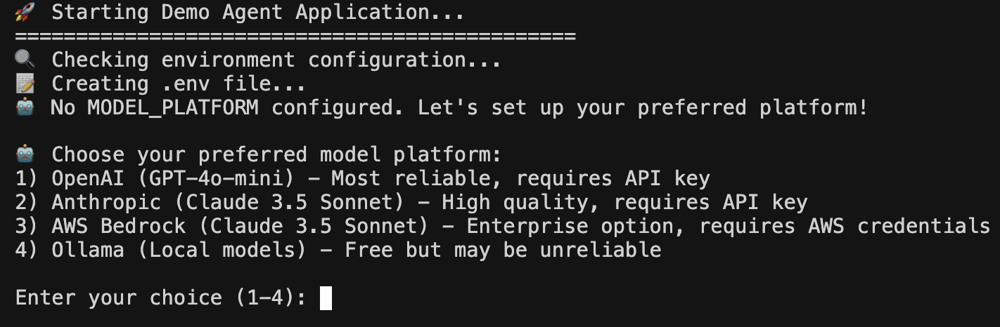
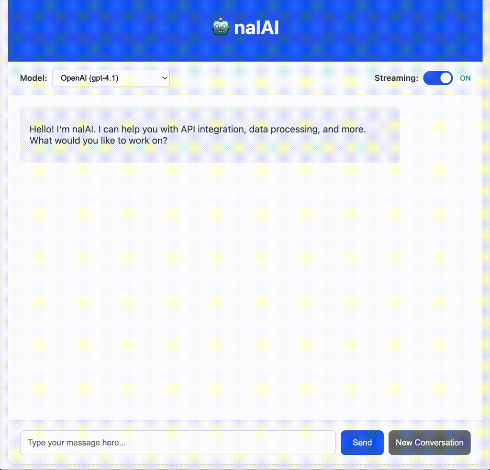

# nalAI

[](LICENSE)
[](https://www.python.org/downloads/)
[](https://github.com/your-org/nalai/actions)

**✨ nalAI (`/næli/`) is like ChatGPT for Stripe, Shopify, AWS,  Kubernetes, and more APIs**:

**Ask, Don’t Search** – Skip the docs.
  > **Human:** "How can I update the stock level for a product?"

**Describe, Don’t Code** – Explain your goal, get results. No coding required.  
  > **Human:** "List our most active customers"

**Stay in Control** – Step in on demand. Approve critical actions before they run.   
  >  **Human:** "Update the stock level for product with name 'smartphone' to 30"   
  >  **AI:** I will execute an API call to update a product. Please, confirm.   
  >  **Human:** Approve | Edit | Reject

**Automate Repetitive Tasks** – Offload routine API work to an autonomous LLM agent.


<br>

## 🚀 Quick Start

Run nalAI locally with a mock eCommerce API in **3 steps**.
> ⚙️ **Prerequisites for Quick Start**
>   
> **Python 3.12+** → [Download](https://www.python.org/downloads/)  
> **Docker & Docker Compose** → [Install Guide](https://docs.docker.com/get-docker/)  
> **An LLM API key** (OpenAI, Anthropic, or Amazon Bedrock)


### 1. Clone the Repository 
```bash
git clone https://github.com/g-pavlov/nalai.git
cd nalai
````

✅ **Result:** Local copy of nalAI source ready to run.


### 2. Launch the Demo Environment

```bash
make ui-run
```

#### 2.1. Select LLM Provider


 
#### 2.2. Provide an API key (Optional - Depends on LLM Provider Choice) 
  

✅ **Result:**

* **Web UI:** [http://localhost:3001](http://localhost:3001)
* **Backend API:** [http://localhost:8000](http://localhost:8000)
* **Environment:** .env in the project root directory.


### 3. Chat with nalAI

Open **[http://localhost:3001](http://localhost:3001)** in your browser and try:

💬 **"List products"** – Returns mock eCommerce product items  
💬 **"Show me how to create an order"** –  Provides instructions and an example code   
💬 **"What is the Products API security schema?"** – Explains the security configuration defined in the API OpenAPi specification.

> ⚠️ *Current demo UI does not support interactive approval for write operations (human‑in‑the‑loop). You can try this with API*




### 🌐 Optional: Use the HTTP API Directly

```bash
curl -s --location 'http://localhost:8000/nalai/invoke' \
--header 'Content-Type: application/json' \
--data '{
    "input": { "messages": [ { "content": "list products", "type": "human" } ] },
    "config": { "model": { "name": "gpt-4.1", "platform": "openai" } }
}'
```

✅ **Result:** JSON response with nalAI’s reply and any executed API calls.

<br>

## 🔗 Onboarding Your APIs

nalAI learns **directly from your API specifications**, not generic knowledge:

* **Understands Endpoints** – Reads available operations, requests, and responses
* **Executes Safely** – Handles authentication and formats real API calls correctly
* **Handles Errors Gracefully** – Interprets API errors and adapts automatically

**How to contribute APIs**

1. Add **OpenAPI 3.x YAML files** to `data/api_specs`
2. Add an **entry** in `data/api_specs/api_summaries.yaml`
3. nalAI will **discover and use** new APIs immediately

> 💡 *See the [Hosting Guide](docs/platform-independent-installation.md) for self‑hosting and enterprise integration.*

<br>

## 💬 Example Prompts

> ⚠️ **These examples require onboarding APIs that are not bundled with nalAI.**   
> To try them, provide OpenAPI specs for your own systems (e.g., SAP, Auth0, AWS).

Try nalAI with natural‑language requests like:

💬 **"What's our revenue this month?"** — Pulls live data from SAP/ERP  
💬 **"Generate Python code to create a new user in Auth0"** — Returns ready‑to‑run snippet  
💬 **"Scale the nginx Kubernetes deployment"** — Executes a safe, human‑approved API call  
💬 **"What are the most requested API features?"** — Aggregates insights from Zendesk & Intercom


💡 *See more in [docs/examples.md](docs/examples.md)*

<br>

## 🎯 Key Use Cases

**📊 Instant Business Intelligence & Operations**  
Query ERPs, CRMs, and eCommerce platforms in plain language.  
Retrieve insights or trigger actions instantly—no dashboards required.

⎯⎯⎯⎯⎯

**💻 Frictionless Developer & DevOps Productivity**  
Generate API code snippets, debug integrations, and manage infrastructure from natural‑language requests.

⎯⎯⎯⎯⎯

**🤖 Autonomous Automation with Human‑in‑the‑Loop**  
The LLM decides which APIs to call and in what sequence.  
Automate tasks and orchestrate workflows while approving critical actions for security.

⎯⎯⎯⎯⎯

**⚡ Rapid Integration & Adoption**  
Provision an OpenAPI spec to nalAI and the API becomes **instantly available** for queries and actions.

⎯⎯⎯⎯⎯

**🏢 Organizational Deployment & Integration**  
Host nalAI yourself and integrate its API into **internal portals, dashboards, or chat apps** for org‑wide access.

<br>

## ✨ Features

**🎯 Goal‑Oriented Control**

* Natural‑Language Goals
* Zero Learning Curve

⎯⎯⎯⎯⎯

**⚡ Real‑Time Autonomous Execution**

* Auto-Orchestrated Tool Use
* Human‑in‑the‑Loop Control
* Secure API Calls

⎯⎯⎯⎯⎯

**🧠 OpenAPI‑Driven Intelligence**

* Learns from API Specs
* Handles Errors Gracefully
* Maintains Context in Workflows

⎯⎯⎯⎯⎯

**🛡 Enterprise‑Ready & Secure**

* Complete Audit Trail
* Compliance‑Friendly (SOC 2, GDPR, ISO 27001)
* Flexible Self‑Hosting & Integration

<br>

## 📚 Next Steps

* [Operations Guide](docs/observability.md) – Monitoring & logging
* [Development Guide](docs/development.md) – Setup & architecture
* [Security Guide](docs/security.md) – Auth, compliance & audit
* [Integration Guide](docs/platform-independent-installation.md) – Hosting & deployment

<br>

## 🤝 Contributing

We welcome issues and PRs! See [CONTRIBUTING.md](CONTRIBUTING.md).
